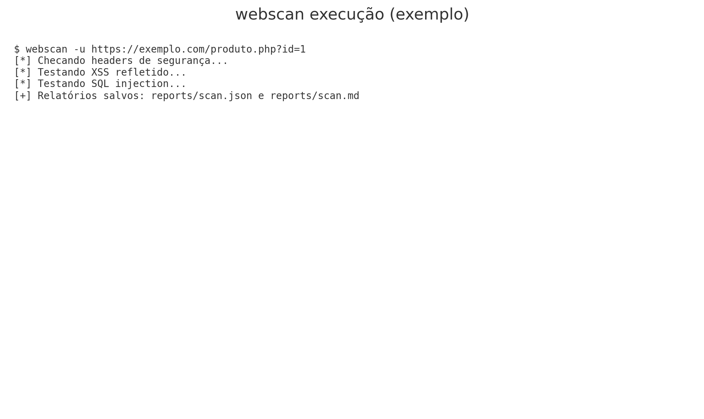
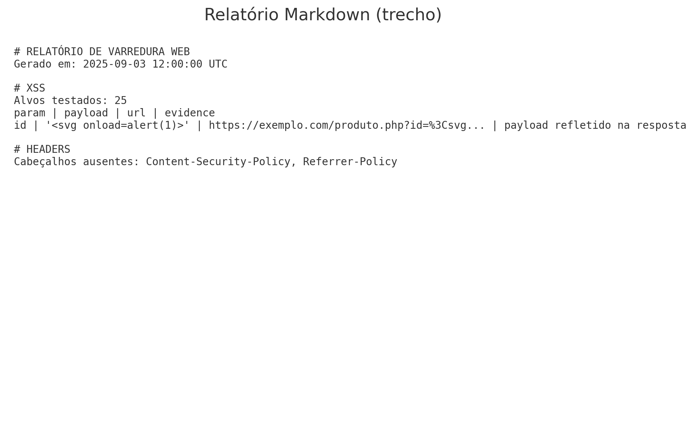

# WebVulnScanner (Python)

Ferramenta estilo **Nikto** (bem mais simples) que verifica falhas comuns em aplicações web:
- **XSS refletido**
- **SQL Injection (erro-based)**
- **Headers de segurança ausentes**

> ⚠️ **Uso ético**: utilize **somente** em sistemas que você possui autorização explícita para testar.

---

## Arquitetura (alto nível)

```
flowchart TD
    A[CLI (argparse)] --> B[Core (requests Session)]
    B --> C[XSS Check]
    B --> D[SQLi Check]
    B --> E[Headers Check]
    C --> F[Results]
    D --> F[Results]
    E --> F[Results]
    F --> G[Reporting (JSON/Markdown)]
```

Estrutura de pastas:

```
webvulnscanner/
  scanner/
    checks/
      xss.py
      sqli.py
      headers.py
      common.py
    reporting/
      report.py
    core.py
    cli.py
  docs/
    prints/
  tests/
  README.md
  requirements.txt
  pyproject.toml
```

---

## Passo a passo no VSCode (do zero)

1. **Criar e abrir a pasta do projeto**
   ```bash
   mkdir webvulnscanner && cd webvulnscanner
   ```

2. **Criar ambiente virtual e ativar**
   ```bash
   python -m venv .venv
   # Windows
   .venv\Scripts\activate
   # macOS/Linux
   source .venv/bin/activate
   ```

3. **Instalar dependências**
   ```bash
   pip install -r requirements.txt
   # ou via pyproject
   pip install .
   ```

4. **Configurar o VSCode**
   - Abra a pasta `webvulnscanner` no VSCode.
   - Selecione o interpretador Python da `.venv` (Ctrl+Shift+P → "Python: Select Interpreter").
   - Opcional: instale extensões **Python** e **Pylance**.

5. **Executar o scanner (exemplos)**
   ```bash
   # checar apenas headers
   python -m scanner.cli -u https://exemplo.com --no-xss --no-sqli

   # rodar tudo e salvar relatórios na pasta padrão "reports/"
   python -m scanner.cli -u "https://exemplo.com/produto.php?id=1"

   # binário via entrypoint (após pip install .)
   webscan -u https://exemplo.com
   ```

6. **Ver relatórios**
   - JSON: `reports/scan.json`
   - Markdown: `reports/scan.md`

7. **Rodar testes (opcional)**
   ```bash
   python -m pytest -q
   ```

---

## Como funciona (resumo técnico)

- **XSS**: injeta payloads em parâmetros de query (reais e comuns) e verifica **reflexão do payload** (incluindo encoding simples).
- **SQLi**: injeta payloads clássicos e procura **assinaturas de erro de banco** na resposta.
- **Headers**: verifica presença dos cabeçalhos recomendados (CSP, X-Frame-Options, etc.) e anota observações.

> Limitações: não faz *crawler*, não autentica, não executa *DOM-based XSS*, não faz *time-based blind SQLi*, etc. É intencionalmente simples.

---

## Exemplos de uso (prints)

Veja em `docs/prints` capturas ilustrativas da execução do CLI e do relatório Markdown.




---

## Opções de linha de comando

```
usage: webscan [-h] -u URL [--no-xss] [--no-sqli] [--no-headers] [--timeout TIMEOUT]
               [--insecure] [--report-dir REPORT_DIR] [--basename BASENAME]

Scanner simples de vulnerabilidades (XSS, SQLi, headers inseguros)

options:
  -h, --help            show this help message and exit
  -u URL, --url URL     URL alvo (ex: https://site.com/page.php?id=1)
  --no-xss              Não executar teste de XSS
  --no-sqli             Não executar teste de SQLi
  --no-headers          Não checar headers de segurança
  --timeout TIMEOUT     Timeout das requisições (s)
  --insecure            Não verificar TLS/SSL (verify=False)
  --report-dir REPORT_DIR
                        Pasta para salvar relatórios
  --basename BASENAME   Nome base dos arquivos de relatório
```

---

---

## Interface Web (React + TypeScript)

O projeto inclui um frontend moderno em React + TypeScript para uso via navegador:

1. **Suba a API** (em um terminal):
   ```bash
   uvicorn api.main:app --reload --port 8000
   ```

2. **Instale e inicie o frontend** (em outro terminal):
   ```bash
   cd frontend
   npm install
   npm run dev
   ```

3. Acesse **http://localhost:5173** — interface com formulário de varredura, seleção de testes e visualização de resultados em tempo real.

---

## Aviso Legal

O autor **não se responsabiliza** por usos indevidos. Teste **apenas** com permissão.
